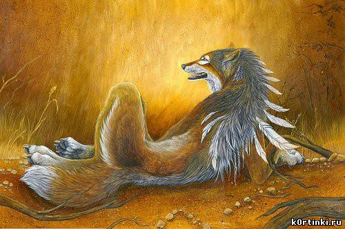

В глубине леса жил Старый Мудрый Индеец. В самой натуральной чащобе. Чем он там жил, большинство лесных обитателей никак не могли понять. Охотиться, не охотился, на огороде только заячья капуста, да зверобой, грибов, и тех нет. А над вигвамом постоянно дымок и ароматы такие, что вороны совы в обморок от восторга падали. Лис, правда, говорит -- торгует. Да, только, с кем ему торговать, и чем?

Лис с серьезной мордой клялся Медведю что, точно с Древним Могучим Волхвом торгует. У того добротный, всегда чисто прибранный домик, украшенный веселой непристойной резьбой и черепами стоит тоже посередь чащобы. Но, другой -- той, что за Непролазным Оврагом. Да чем торгует то?! Нечем!, -- махал лапой Медведь. А Лис вокруг вьется, аж тявкает, поражаясь медвежьей непонятливости. Да дорогами же и торгует. Тропками, да дорогами, перекрестками и поворотами, полянками скрытыми, да гатями проверенными, по которым между мирами и звездами ходить можно. Вон, видал, какой знатный окорок Старому Мудрому третьего дня Чёрный Журавль приволок? Тащил, надрывался, в чащобе чуть крылья не поломал, только с третьего раза на посадку зайти смог! Как думаешь, за что ему такую вкуснятину притаранили? Да и, кто прислал то? Если все знают -- Черный Журавль у Волхва который век в первых помощниках ходит! Во! То-то, же. И Лис облизывался. Уж больно вкусный был тот окорок. А Медведю знать незачем, с какой радости Индеец Лиса тем окороком потчевал. Да еще пообещал зимой мышиные норы со всеми входами-выходами показать! Хорошая сделка. Хорошая плата за то, что показал Лис перекресточек у тонкой осинки возле Непролазного оврага. Не лисий то перекресточек, уж больно сильно оттуда звездным ветром дует. 

А Индейцу с Волхвом, вон, сгодилось.

